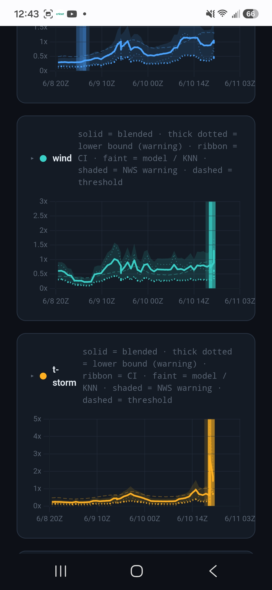
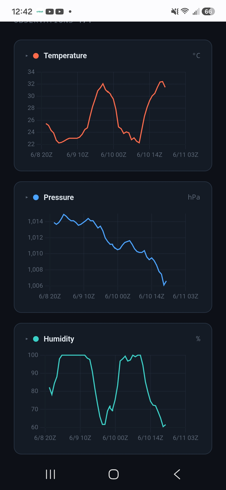
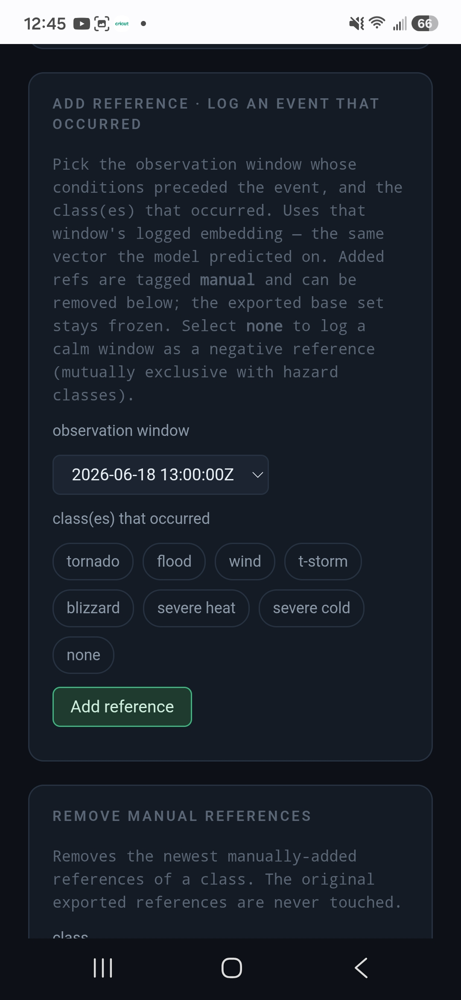
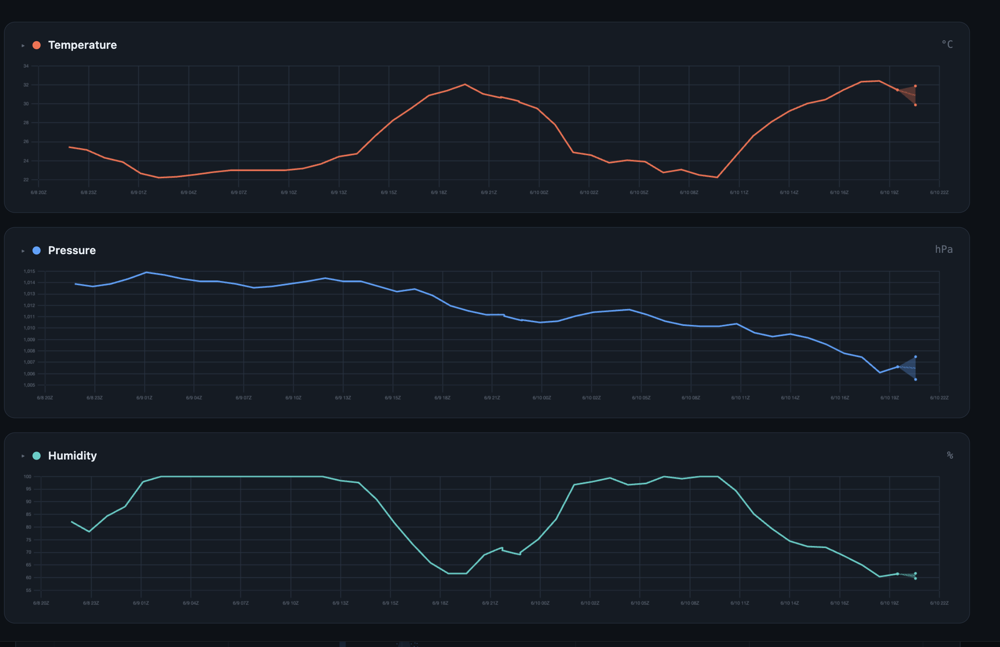

# Weather Station Alpha
## Severe Weather Prediction Using Local Data

<br>
<div class="image-row" style="display: flex; gap: 10px;font-size:75%">
<div>
  
  <br>
Current Severe Weather Predictions <br>Overview Page
  </div>
  <div>
  
  <br>
  Historical Prediction Accuracy <br> Vs Real Warnings Compare Page
  </div>
  <div>
  
  <br>
  Local Sensor Data <br> Historical Log Page
  </div>
  <div>
  
  <br>
  Admin Panel for Real-Time <br> Learning Sample Selection
  </div>
</div>
<br>


### Overview

This project has 3 main basic parts:
1: Logging the sensor data from the USB barometer, and the remote sensors, writing them to csv
2: A pair of machine learning model ensembles trained on historical  weather, watch, and warning data. One trained to look 1h into the future, the other trained to look 24h ahead into the future. Both feature a KNN component, for real-time learning without retraining the underlying neural net.
These models are run against the locally gathered data once every 30 minutes. 
3: A web server and UI for adjusting warning thresholds, administering the sample for real time learning, viewing the collected data, and viewing the output of the severe weather models

### Parts List
##### Compute:
* **RaspberriPi** 3B+ 
* 120v AC ->5v 3a DC power supply for micro usb
* 32 Gb microSD card
* 128 Gb USB flash drive
* 3" USB cooling fan: 5v .2A
##### Sensors and IO:
* **Obet** Digital Weather Station
    * *Base unit model*: B66
    * *Wireless sensor model*: BTX3
* **Starpath** USB BARO
    * *ASIN* B0CYJGZS8H
* **Nooelec** RTL-SDR NESDR Smart - v5 Bundle 
    * *MODEL NUMBER* 100700 
##### Fancy Enclosure
* **ZulKit** Blue Metal Project Box
    * *7.9"x6.5"x3.5"*
    * *UPC* 788397727303
* White Permenant Vinyl
* Black Rubber Grommets 

### Requirements*
* Wifi
* A computer that can run and has:
    * A browser
    * SSH/SCP
    * Raspberry Pi Imager
    * Enough memory to hold the ubuntu server 22.04 (LTS) image
    * An SD card slot.

##### *for basic use with the existing models, using multi-shot learning via knn, not training your own models

### Setup

#### System

First, flash the microSD with Ubuntu Server 22.04 (lts). 

Make sure your username is set, and that the wifi and ssh are enabled.

Plug in the microSD, the USB flash drive, the USB Baro, the USB SDR, and the cooling fan. 

Power on the pi and WAIT for cloud-init to complete. this only happens on the first boot, but can take a long time. 

#### Custom rtl_433 Protocol for Obet Sensors

On your main machine, ssh into the pi

*In the following commands, replace ```<username>``` with the username you put on the pi image.*
```bash
ssh <username>@<ip.of.your.pi>
```
enter your user's password, and hit enter. Once inside, we will do some setup.

First, install git:
```bash
sudo apt install update
sudo apt install -y git

```

then, clone this repo:
```bash
cd /home/<username>/
git clone https://github.com/dmuscatella/weather_station_alpha.git
```
Clone the rtl_433 library. We have to modify it a bit and compile it from source, because the native library doesnt natively pick up the humidity channel of our chosen sensors.


```bash
cd /home/<username>/
git clone https://github.com/merbanan/rtl_433.git
```
copy the file ```oria_wa150km.c``` from ```/home/<username>/weather_station_alpha/``` , into the rtl_433 library, replacing the file that is there with ours
```bash
cp /home/<username>/weather_station_alpha/oria_wa150km.c /home/<username>/rtl_433/src/devices/oria_wa150km.c
```
install the dependancies
```bash
sudo apt install -y cmake librtlsdr-dev libusb-1.0-0-dev  build-essential cmake pkg-config rtl-sdr software-properties-common 
```
then recompile it.
```bash
mkdir -p /home/<username>/rtl_433/build && cd /home/<username>/rtl_433/build
cmake ..
make -j2
```
Then, assuming your Obet sensors are up and the USB SDR is plugged in and functioning, we test it by running this command:
```bash
/home/<username>/rtl_433/build/src/rtl_433 -R 288 -F json
```
It should start showing the outputs of your sensors, every 30 seconds or so, as nice, formatted, json.

```ctrl+c``` to exit the rtl_433 test

#### Installing Misc Dependancies
Next, we need to install dependancies for the other systems

```bash
sudo apt install -y software-properties-common
sudo add-apt-repository ppa:deadsnakes/ppa
sudo apt update

sudo apt install -y python3.10 python3.10-dev python3.10-venv
```
then, we need to set up our python virtual env for the sensor monitoring, machine learning and webserver scripts.
```bash
cd /home/<username>/weather_station_alpha
python3.10 -m venv weather_env
source weather_env/bin/activate
python3.10 -m pip install --upgrade pip && python3.10 -m pip install -r requirements.txt
```

use this command to find connected usb devices:
```bash
sudo lsusb
```
determine which connected device is the barometer.

 Modify ```/home/<username>/weather_station_alpha/sensor_reader_writer.py``` to match the path of our attached baro usb.
 
Make sure it is also using the proper path for our compiled rtl_433.

Then, identify the flash drive usb port. Format it for ext4, and mount it at ```/mnt/DeepData/```. Modify the ubuntu fs-tab file to perminantly mount the drive.

once complete, running ```python3.10 sensor_reader_writer.py``` should show the inputs comming in. 

```ctrl+c``` to exit the sensor script test.

### System Service Configurations

To ensure the scripts activate their virtual environments and run reliably in the background upon system reboot, we implement individual systemd unit files.

#### Setting Up The Local Sensor Service

Create the service configuration file:
```bash
sudo nano /etc/systemd/system/weather-sensors.service
```
and put this text in it, putting your user name in the proper place:
```ini
[Unit]
Description=Weather Sensor Reader and Writer
After=network.target

[Service]
Type=simple
User=<username>
Group=<username>
WorkingDirectory=/home/<username>/weather_station_alpha
ExecStart=/home/<username>/weather_station_alpha/weather_env/bin/python /home/<username>>/weather_station_alpha/sensor_reader_writer.py
Restart=always
RestartSec=5

[Install]
WantedBy=multi-user.target


```
### Setting Up  The Machine Learning Service
Create the engine configuration file:
```bash
sudo nano /etc/systemd/system/weather-engine.service
```
Paste the following block:
```ini
[Unit]
Description=Weather Predictor ML Live Engine
After=weather-sensors.service

[Service]
Type=simple
User=<username>
Group=<username>
WorkingDirectory=/home/<username>/weather_predictor_src
ExecStart=/home/<username>/weather_station_alpha/weather_env/bin/python /home/<username>/weather_station_alpha/live_engine.py \
  --arch lstm_attn --model model_package_lstm_attn \
  --scaler-npz build/scaler_LOCAL.npz --knn-csv refs.csv \
  --station LOCAL --location "<username>'s House" --warn-wfo LOT --warn-ugc ILC197 \
  --out /mnt/DeepData/live_log_LOCAL.json --interval-min 15
Restart=always
RestartSec=10

[Install]
WantedBy=multi-user.target


```

### Setting Up  The UI Service
```bash
sudo nano /etc/systemd/system/weather-ui.service
```
Paste the following block:
```ini
[Unit]
Description=Weather Predictor UI Server
After=weather-engine.service

[Service]
Type=simple
User=<username>
Group=<username>
WorkingDirectory=/home/<username>/weather_predictor_src
ExecStart=/home/<username>/weather_station_alpha/weather_env/bin/python /home/<username>/weather_station_alpha/ui_server.py \
  --logs-dir /mnt/DeepData --refs-csv refs.csv --thresholds thresholds.json --emb-dir . --port 8000
Restart=always
RestartSec=5

[Install]
WantedBy=multi-user.target


```
### Enabling the Weather Services on Boot
Finally, we need to tell the daemon about the new services, and bind them to run whenever the kernel boots.

```bash
sudo systemctl daemon-reload

sudo systemctl enable weather-sensors.service
sudo systemctl enable weather-engine.service
sudo systemctl enable weather-ui.service

sudo systemctl start weather-sensors.service
sudo systemctl start weather-engine.service
sudo systemctl start weather-ui.service
```
#### helpful for debugging:
to read the live logs of the services:
  ```bash
  sudo journalctl -u weather-sensors.service -f
  sudo journalctl -u weather-engine.service -f
  sudo journalctl -u weather-ui.service -f
  ```
to stop the services if you ever need to:
```bash
sudo systemctl stop weather-sensors.service
sudo systemctl stop weather-engine.service
sudo systemctl stop weather-ui.service
```
and to restart them instead of stopping them completely:
to stop the services (only on an error):
```bash
sudo systemctl restart weather-sensors.service
sudo systemctl restart weather-engine.service
sudo systemctl restart weather-ui.service
```
## How It All Works

The Raspberry Pi Runs Ubuntu Server.

The functions are broken into 3 services, which systemctl manages: the Weather Sensors service, the Weather Engine service, and the Weather UI service.

The Weather Sensors service gathers temperature and humidity from our outside sensors from over the radio, as well as gathering the local pressure from an on-board barometer. It saves this data every 5 minutes.
The Weather Engine service runs the machine learning models on the local data every 30 minutes, and the Weather UI service hosts the API and front end for the data UI.


### The  Weather Sensors Service

the BTX3 wireless sensor transmits it's identity, the temperature detected , and the humidity over the radio at 433 mHz. These transmission happen every 30 seconds, for each sensor.

The rtl_433 library talks to the usb SDR, and monitors the 433 mHz radio band for traffic. When a transmission is detected, it decodes the bytes, and returns the data as nice, formatted JSON objects.


Out of the box, rtl_433 could decode only the termperature and identity, because the variant of the protocol that initially worked was designed for a freezer thermometer, which only transmits temperature. After some time reverse engineering what bits where what in the signal, I figured out how to modify the 288 protocol to also return the humidity. This is why it needs to be recompiled with my special file at initial setup.

A python program is monitoring the output of rtl_433, and when transmissions come, it holds them in a buffer. For every temperature and humidity 'hit', the service will also gather a data point from the on-board barometer, holding that data in the buffer as well.

Every 5 minutes, the measurements in the buffer are averaged together, and saved to a csv file. By this I mean we average all the temperature measurements in the period, then we average all the baro measurments in the period, and we average all the humidity measurments in a period.  This averaging is to reduce noise in the measured signals.

This effectively puts our data 2.5 minutes into the past, as we essentially are sampling the midpoint of the 5 minute window instead of just the end of it. This is an acceptable tradeoff for the added stability and reduced noise in our measurements. 

The buffer is emptied after the data is written to file.

The python script orchestrating all of that is called by ```weather-sensors.service```

### The Machine Learning Service

The prediction engine is built off of 2 networks as the backbone.They are identical in arcitecture: one trained with a 1h time horizon for prediction, and the other with a 24h window for prediction. 

#### The Training Data

The training data was gathered from  30 years of NWS weather stations around Illinois, from 1995 to 2025. The data includes the measurment times, the temperature in F, the pressure in mPa, and the humidity as a percentage. 

To label our traning samples, we gathered the corresponding watches and warnings issued by the NWS for those times and areas, 1h and 24h from the measurment point. These became the class labels for training. 

#### The Neural Network

The neural network consists of 2 parallel 1d convolutional legs. One takes in the last 48 hours of 5 minute-ly data, and the other takes in the last 7 days of hourly data. 

The output of the convolutional layers are pooled by a layer of LSTM units, and an attention layer. 

After the attention layer, There is a dropout layer and a few fully connected layers, before the sigmoid classifier output layer.

we use BOTH the output from the classifier, and the activations from the N-1 layer, for our prediction pipeline.

#### Scaling the Neural Net Inputs

An input scaler derrived from the mean and std deviations of the NWS stations the training data is gathered from, is used to normalize everything to 'Cook County' ranges. 

This normalization is performed by ```normalize()``` in  ```inferrence.py```, by calculating ```(X - mean) / std```, where X is our input data.

The local weather station spent a week 'calibrating' by gathering its data, and comparing it's meaurment means and variances to the closest NWS station over the same period. This is used to generate a "Local Scaler" that is saved as an npz file. This is used to scale our local sensors to the range the neural net is expecting, more closely matching the behavior of the ASOS data that our system was trained on. 

#### Dropout Monte Carlo Simulation

##### Monte Carlo

 A Monte Carlo Simulation is a modelling method that involves running the input data over hundreds of identical simluations, except the starting points have been perturbed slightly around a distribution for each simulation, each one subtly different. The size and shape of this distribution is governed by historical trends, if simulating sequential data.

 In financial modelling, this is useful for determining the possible future price of stock options given the current prices, market trends, and conditions. We can find the maximum amount up or down it's likely to move over some time period, and the mean price that it is ultimately most likely to end up at.

##### Dropout

When active, a dropout layer will randomly set some percentage of it's outputs to 0, randomly assigning different ones to be active or inavtive each time the model is run. When deactivated, the layer just passes the outputs through as normal. 

 These layers are usually used as a method to prevent neural network modelsfrom overfitting during training, and are also *usually* deactivated when running inferrence on the model, because of the random noise they introduce. However, I want to leverage that noise in a Monte Carlo Simulation.

##### Incorporarting Dropout and Projections into the Monte Carlo

 For our Monte Carlo, we get the predicted probabilities by running the model **250 times** on the input data, but we keep the dropout layer active. This adds enough noise to run a monte-carlo, giving us a novel way to produce  a perterbation distrobution with the method.

 Because our dropout rate is relatively low (0.02), we also take the percent change of our latest measurements vs the measurments at t-1h, and project that into the future, adding a randomized set of input variants centered around that projection as the mean, with the percent change being used to scale the standard deviation of this distribution. This effectively covers the entire range from "reversing trend" (more than 1std away, in the other direction), staying the same (1 std deviation away, in the other directino), "following the same trend" (falling around the mean), "the trend accelerates" (1 std away, in the same direction), and "the trend gets way worse" (more than 1 std away, in the same direction)

   
 
*The ui will show the values explored in our projected monte-carlo simulations, shown from the end of the latest data*

 The 5 minutely points are interpolated between t-0 and our sample's projected t+1h, to fill in the gap. we apply a randomly scaled and shifted sigmoid transformation with random pertubations on top, to mimic real data.


*Here are 5 randomly generated interpolations for 5 minutely data, an hour each, going between the same pairs of values: [75.0,40.0,1000.0] and [65.0,85.0,975.0]*

 The oldest seasurements are 'popped' off the inputs, so that the neural net gets inputs of a constant size.

 This gives us a maximum probability, a minimum probability, and a mean probability. Importantly, unlike a 'naive' confidence interval, it is not *always* semetric around the mean. 

 This will become important when we combine the models in an ensemble, of which this Monte Carlo is one half.

#### K Nearest Neighbors
The other half of the ensemble is a K Nearest Neighbors algorithm. 

K nearest Neighbors is a machine learning method in which each data point is represented as a higher dimensional vector, with an 'example set' of vectors mapped to their classes.

When a new, unknown, sample comes in, we turn it into a vector, and compare it's distance to all of our example vectors. 

For K = 5, we look at the 5 closest examples, and they 'vote', majority wins. If 3/5, or more, of our closest samples are a thunderstorm, the algorithm classifies our new, unknown, vector as as t-storm.

I use a variant called Distance Weighted KNN, where instead of a 'raw' 'vote', their 'votes' get weighted by 1/(their distance to the new vector + epsilon). In this way, more similar vectors contribute more to the probability than dissimilar vectors. 

I populated all the classes with a subset of both their most typical cases, as well as the ende cases where the model puts their vectors close together. Literal 'edge cases'.

I then populated the 'none' class with a random sampling of the other data points, about 10x as many as the labeled class samples.

For KNN, the dropout layer is **deactivated** at inferrence, so that the output is **deterministic**. we use the activations of the N-1 layer of the network as our vector.

The confidence interval is derived from whole class similarity. The manifold flattens to a scaler with the cosine distance. As a result, unlike the Monte Carlo confidence interval, the KNN confidence interval is symetric. 

#### KNN as a Real Time Learner.

This is the true strength of the system, and the part I am the most proud of. In the ui, there is an admin panel for managing the examples used by the KNN.

If a t-storm passes, but the system fails to alert, we can select the relevant time stamps from our data, select the 't-storm' class, and hit submit. This'll encode that observation data at that time as a vector with our neural net, and save that vector under the 't-storm' examples. 

KNN will use that example going forward, and will recognize those conditions the next time they arrise.

Conversely, this is also useful for tamping down false positives. 

If the system is sending a bunch of alerts and warnings when noting is happening, i can add the data from the relevant observation times under the 'none' class, and save it. The next time those conditions arrise, the KNN will recognize that it's no big deal.

In this way, the system learns in real time, **without needing to retrain the underlying neural network**, about the local climatology as well as the quirks and variances in my particular sensor setup vs the fancy sensors the National Weather Service that generated the data the system was trained on.

#### Prediction Ensemble and Confidence Resolution
When data for a new observation time is fed into our model, we run our projections and simulations for the Monte Carlo, and, for each class, get the min, max, and mean probabilities from the simulations. 

After running our Monte Carlo, We then disable the dropout layer, and run the data for the observation time thru the KNN. We get class probabilities derived from their relative distances, deriving a confidence interval from the class similarity.

The probabilities from both methods are logged, then averaged together to give us our 'true mean'. 

The upper confidence from the monte carlo is multiplied by the confidence for the knn, and used as the total upper confidence interval, above the mean.

Conversely, the lower confidence from the monte carlo is multiplied by the confidence for the knn, and used as the total lower confidence interval, below the mean.

We express the class probabilities as a ratio relative to the 'none' probability. 

"How likely do we think this is to happen relative to nothing?"

If t-storm probability is at 15%, and none probability is at 30%, the model is saying that a t-storm is half as likely as nothing: **a probability-vs-none of 1/2**. if t-storm probability is at 60% and none probability is at 30%, the model is saying that a t-storm is twice as likely as nothing: **a probability-vs-none of 2**.

Expressing these probabilities in terms of their ratio to the none probability gives us a much more robust signal than the raw probabilitites alone.

#### Watch, Advisory, and Warning Threshold Tuning.
Having a max probability, a mean probability, and a min probability for each class allows us more nuance in predictions when using thresholding. 

We use the max for watches, the mean for advisories, and the min for warnings, each independantly tuned. 

"The model is getting a weak signal: a 1 in 100 shot", vs "the model is getting a moderate signal, and but has mixed confidence", vs "the model is getting a strong signal, is highly confident and even the most unfavorable monte carlo paths for that class are showing the thing happening"
### The UI Service


## Training Your Own Model

...